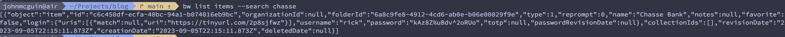
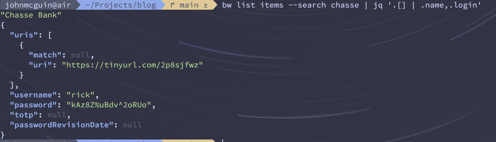

# Searching For Passwords With the Bitwarden CLI

I recently migrated to the Bitwarden password manager and discovered they have a first class command line interface. Since I almost always have a terminal open, I decided to adopt the cli over the macOS app for my core usage. My core problem is that the output is difficult to parse as an unformatted JSON string. I decided to reach [jq](https://jqlang.github.io/jq/) to help process the output for my core usecase of searching for a password by name.

## Establish A Session

All of the steps below will work but you will be prompted for you password every time. To establish a persistent session with the vault, [follow this tutorial](/blog/bitwarden-session)

## The API

The API we are looking for here is `bw list items`. They already provide a handy helper to search the output with the `--search` flag. You can go more in depth here, filtering on organization, folders, etc, but for my usage I am generally looking to search across my entire vault. Let's explore this API briefly to see it in action. If we run the following command:

```bash
bw list items --search chasse
```

we get the following output:


You can see that there is a bit to be desired here. There is a lot of data that we probably don't care about. This is also only one entry. Imagine parsing this when you search for something a bit more generic which has multiple matches. It quickly becomes impractical.

## Adding JQ

Now let's expand this example by adding jq to help query and format this JSON. Using the previous command as a base, let's pipe the output into `jq` for further processing. First, we will iterate the array `(via .[])`, then select the fields we are most interested in. For me, I want the name and the login credentials. The name so I can identify the correct entry in the case of multiple entries and the login credentials so I can quickly access the password. Now if we run the following command:

```bash
bw list items --search chasse | jq '.[] | .name,.login'
```

we get the following results:


As you can see, it's a lot cleaner and a lot more helpful. Of course, you can expand and refine as it fits your own needs. For example, maybe you want to pipe the password directly onto the clipboard with `pbcopy`. The options are open but hopefully this helps establish a useful base.

## Making it a Shell Function

This is helpful and is exactly what I am looking for, but I want to reuse this in a more ergonomic way. Now that we solved the problem, I don't want to have to remember the magic incantation every time. This is a core enough usecase for me that I want my own utility to make it a bit easier. I am not going to go into how to configure custom shell functions across systems, but we'll go over the function and idea at least. I use a MacBook and macOS has starting shipping `zsh` as its default shell. Many of us were already running `zsh` via [oh my zsh](https://ohmyz.sh/), the zsh framework long beloved by mac users. Within `~/.oh-my-zsh` there should be a `custom` directory. We'll create a new file under this directory via:

```bash
touch ~/.oh-my-zsh/custom/bitwarden.zsh
```

This command creates a new file called `bitwarden.zsh` within this directory. Oh My Zsh will automatically source these files so we should be good to just start scripting straight away. In this newly created file, paste:

```bash
bwfind() {
  bw list items --search $1 | jq '.[] | .name,.login'
}
```

This is the exact same behavior we had before with the only addition being that the `--search` value comes from the first argument to the shell function. Now this gives us an API where we can run:

```bash
bwfind chasse
```

and receive the same results as before.

Optionally, you can alias the function if you wish by typing just below the function definition:

```bash
alias bwf="bwfind"
```

## Conclusion

That's it! We learned how to search for passwords with the Bitwarden CLI, how to process the JSON results with jq, and how to abstract that into a shell function for a bit of a nicer API. I hope that helped and that you learned something along the way. Cheers.
