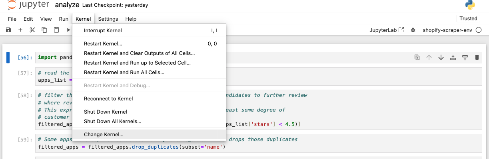
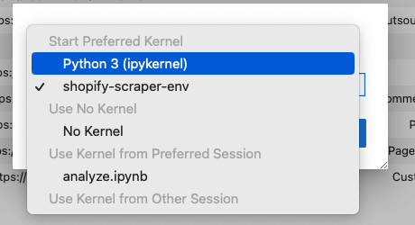

I've written almost no Python but have recently been dabbling a little bit to explore some of the AI tools such as langchain. I recently had the need to write a web scraper and thought it would be a good time to practice a little Python since it seems to be a great tool and choice for that domain. My goal was to write a simple script that would take a base URL, extract some data, paginate, and run the same extraction function until the last page. I wanted to write all results to a csv that I could then explore further. After creating the csv, I wanted to be able to explore the data in a Jupyter Notebook. It took me a while to figure out how to isolate my notebook dependencies to the virtual environment. Maybe this post will be found by other beginners trying to do the same.

## Creating the virtual env
First, I created the virtual env with `venv` by running
```bash
python3 -m venv env
```
This provided me with a virtual environment for my scraper project. I activated the virtual env by running:
```bash
source /env/bin/activate
```
If these steps were successful so far, you should see the name of your virtual environment in your shell prompt. From here, you should have `python` and `pip` in your virtual environment's path. Now you can install your dependencies for your project.

## Creating a custom Jupyter kernel
Fast forward to the point where you have a working Python project. You've packaged up your dependencies for the project and now want to be able to run this virtual environment from within a notebook. This is the part that had me stumped for a little while. You likely need to install `ipykernel` which is a package for creating Jupyter notebooks Python kernels. Make sure to activate your `venv` and then in the active virtual environment shell, install `ipykernel`
```bash
python -m pip install ipykernel
```
Once the dependency is installed, you can now proceed to create the custom kernel.
```bash
python -m ipykernel install --user --name=env --display-name="<some-better-name-you-will-recognize>"
```

## Selecting the custom kernel
After launching `jupyter notebook`, select "Kernel" -> "Change Kernel"



If you had successfully created your kernel, you should see it referenced here under the display name that you used to flag the kernel (in my case this is called shopify-scraper-env).



Once you've selected your custom kernel, you should be able to import project dependencies without `pip install`ing them globally. If you can't import your dependency, something has likely gone wrong.

## Debugging
For me, I built the kernel outside of the `venv` and the creation was succesful but I didn't have access to my packages. For starters, verify that your kernel was created with

```bash
jupyter kernelspec list
```
If your kernel was created, you should see it listed here. If your kernel was listed, it should have printed out with a path. Navigate to that base path and run the `ls` command. There should be a `kernel.json` file. If you look into the `kernel.json`, you should see which python executable the kernel is using. This should be using the version of python found in your virtual environment and if it's not, you likely need to make sure you repeat the steps to create the kernel from within your _activated_ `venv`. The `kernel.json` _should_ look something like this
```bash
{
  "argv": [
    "<path>/<to>/<your>/<project>/env/bin/python",
    "-m",
    "ipykernel_launcher",
    "-f",
    "{connection_file}"
  ],
  "display_name": "shopify-scraper-env",
  "language": "python",
  "metadata": {
    "debugger": true
  }
}
```

## Updating dependencies
If you're successfully importing your virtual environment dependencies from your notebook, congrats! You're successfully tinkering but need to add a new library or two for the investigatory work you're doing in the notebook. No worries! Basically repeat the process as before. After installing your dependencies, just re-run the command to generate the kernel. In my experience, after doing this, I was good to go. If this doesn't work automatically for you, you could try restarting the kernel through the notebook GUI.