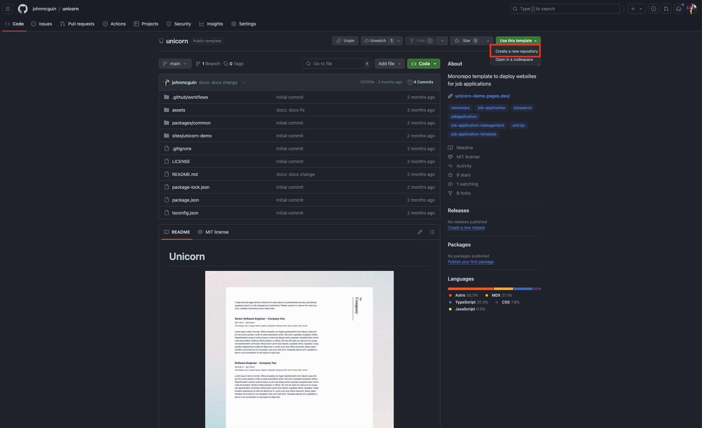

Introducing [Unicorn](https://github.com/johnmcguin/unicorn), a monorepo template built on GitHub
Actions and Cloudflare to help you stand out in your job applications by deploying a static site for
each job application.

## Create repo

First, you'll need to clone the template repository to your own, working repository.



## Clone into repo

Next, clone your new repository to your local dev machine and install dependencies.

```bash
npm install
```

## Create a site

The easiest way to create a site is to use the `npm run new` command. This is the basis of creating
a new site based on the template site that lives at `sites/template`. You can consult the help docs
by running `npm run new -- --help`. Take a minute to read the output.

```bash
$ npm run new -- --help

> unicorn@0.1.0 new
> scripts/new_site.mjs new --help

Usage: Unicorn CLI new [options]

Create a new website

Options:
  -d, --dir <name>      name of the directory
  -j, --job <title>     job title you are applying for
  -c, --company <name>  name of the company. This will be used in website copy.
  -h, --help            display help for command
```

The options themselves should be fairly straightforward. What is happening behind the scenes is that
the directory flag will make a copy of the template site and create a new site at
`sites/<directory>`. The job and company flags will be used for text substitions throughout the
website's copy. This should inform the copy that you write for your own version of the template
site. The template site is meant to be customized! It is recommended to write the template site out
to minimize the amount of work required after running the script. When customizing the template,
there is an assumption that the script makes, which is that the template is substituting all
instaces of the string "Company" with the value passed into the `--company` flag. It replaces all
instances of the string "Job Title" with the `--job` flag. Write your template accordingly!
Alternatively, you can customize the script to suit your exact needs. This is not meant to be a
silver bullet but more of a starting off point for your own personal automations to this process.

When you are done with the `npm run new` script, you have a new site! The output states how exactly
to run your new site. The only manual steps that you have are to:

1. Create a Cloudflare Pages project
2. Add an entry to `sites.json` where the key is the directory name and its value is the name of the
   Cloudlfare Pages project.
3. Customize the site (resume, copy, etc) to the specific job application.
4. Push and monitor the action to make sure the deployment was successful. If everything went right,
   you should now have a new site live.

## Deployment

You've developed your website and are ready to deploy it. First, either create or login to your
Cloudflare account. In your Cloudflare account, navigate to "Profile" -> "API Tokens" -> "Create
Token". Under the "Custom token" section, click to create a custom token. Give the token a name and
the edit permission to Cloudflare Pages. Copy this token and navigate to your GitHub repository. Add
a GitHub secret named 'DEPLOY_TOKEN', pasting the token from the previous step as the value. Add
another secret called 'CLOUDFLARE_ACCOUNT_ID'. Obtain the value for this from the Cloudflare
dashboard. Navigate to the "Workers and Pages" section in your Cloudflare account. You should be
able to copy the account id from the sidebar of this web page. The workflow will use these secrets
to deploy your websites to your Cloudflare account.

While in the Cloudflare dashboard, create your first site. Navigate to "Workers and Pages". Select
"create application". Select "Pages" tab. Select "Create using direct upload". Select "Upload
assets", although we will be skipping the actual upload of assets (the GH action workflow will do
this for us, we just need to create the pages "project" at this point). Give the project a name, and
select "Create project" without uploading assets. Take note of the project name you provided. Update
the GitHub action's matrix property with this value. You should update the 'project' key.

At this point, everything should be setup for a deployment to succeed. To test this out, push your
working repository to the GitHub remote and watch the action run.

## DNS

DNS is out of scope for this post. For my own job applications, I use Cloudflare name servers and
deploy each website as a subdomain to a personal TLD, which works quite well.

_If you have any issues following this post, please open an issue on GitHub._
